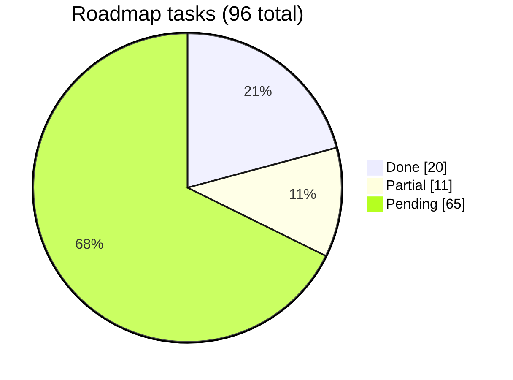

# Boilerplate Roadmap

Hardening & maturity roadmap for this API-first FastAPI + Next.js boilerplate,
backported from two production projects on the same stack (**bioflow** and
**pet-portal**). The goal: a new project starts day 1 on a robust, secure,
mobile-ready foundation — the API feeds a future **Flutter** app in a separate repo.

Every task carries a **Source** column pointing at the exact file/phase to port
from, so implementing a phase is a lookup, not a redesign.

## Progress

| Phase | Focus | Done | Partial | Pending | Total | % |
|-------|-------|------|---------|---------|-------|---|
| [00 — Foundation Fixes](phase-00-foundation-fixes.md) | Boot-blocking bugs, end-to-end auth | 8 | 0 | 0 | 8 | 100% |
| [01 — Auth & Mobile Tokens](phase-01-auth-mobile-tokens.md) | Refresh rotation, 2FA, sessions | 3 | 0 | 7 | 10 | 30% |
| [02 — Media & Storage](phase-02-media-storage.md) | R2 docs + Cloudinary images | 0 | 0 | 8 | 8 | 0% |
| [03 — Security Hardening](phase-03-security-hardening.md) | RLS, RBAC, CSP, prod asserts | 3 | 2 | 4 | 9 | 33% |
| [04 — Observability](phase-04-observability.md) | Alert budget, heartbeat, Sentry, health | 4 | 0 | 7 | 11 | 36% |
| [05 — Scalability & Async](phase-05-scalability-async.md) | Caching, async, indexes, pooling | 0 | 3 | 5 | 8 | 0% |
| [06 — API Contract & Flutter](phase-06-api-contract-flutter.md) | Envelope, OpenAPI, versioning | 1 | 4 | 7 | 12 | 8% |
| [07 — Data Lifecycle & GDPR](phase-07-data-lifecycle-gdpr.md) | Soft-delete, erasure, cascade | 0 | 0 | 6 | 6 | 0% |
| [08 — Testing & CI](phase-08-testing-ci.md) | pytest, drift guard, coverage | 1 | 2 | 5 | 8 | 13% |
| [09 — Payments (Stripe)](phase-09-payments-stripe.md) | Webhook idempotency, checkout, plan state | 0 | 0 | 16 | 16 | 0% |
| **Total** | | **20** | **11** | **65** | **96** | **21%** |

## Suggested order

Phases are numbered in rough build order, but they're independent enough to
pull out of sequence:

1. ~~**00** — done.~~ ~~**01** refresh tokens~~ — rotation/reuse/TTL shipped
   (2026-08-08, ported from araguaney); remaining 01.x is 2FA, device
   sessions, server-verified OAuth.
2. **08** — raise coverage toward the 80% gate; add the Postgres harness +
   migration drift guard.
3. **06** — success envelope, cursor pagination, `X-RateLimit-*` headers,
   OpenAPI→Dart codegen (the client-generation half of Flutter readiness).
4. **Push notifications / device tokens** — not yet a phase; the largest
   greenfield gap for the Flutter app (neither araguaney nor this repo has
   it). Add as a phase when the app project starts.
5. **02**, **03**, **05**, **07**, **09** — pull in per project need.

## Legend

- **Complexity** — 🟢 Low · 🟡 Medium · 🔴 High
- **Status** — ✅ Done · 🟡 Partial · ⬜ Pending

## Editing rules

- Keep the **Source** column accurate — it's the whole point (backport, don't redesign).
- When a task lands, flip its Status and update this index's counts + mermaid pie.
- New hardening work from bioflow/pet-portal → add a row to the matching phase, not a new phase, unless it's a genuinely new domain.
- Convert relative dates to absolute in task descriptions.

## Reference projects

- **araguaney** — the 2026-08-08 port source: Cloudflare shared-secret origin
  auth, refresh rotation w/ benign-reuse window, alert budget, cron heartbeat,
  contract fingerprint test, rate-limit coverage test, user-keyed limiting,
  frontend origin-auth interceptor + Sentry 10 wiring.
- **bioflow** — most mature (46 phases). Best source for: observability, API contract, deprecation, audit mixin, ARQ crons.
- **pet-portal** — best source for: storage `StoragePort`, RLS, GDPR deletion, app-factory split, prod-safety asserts, CI drift guard.
